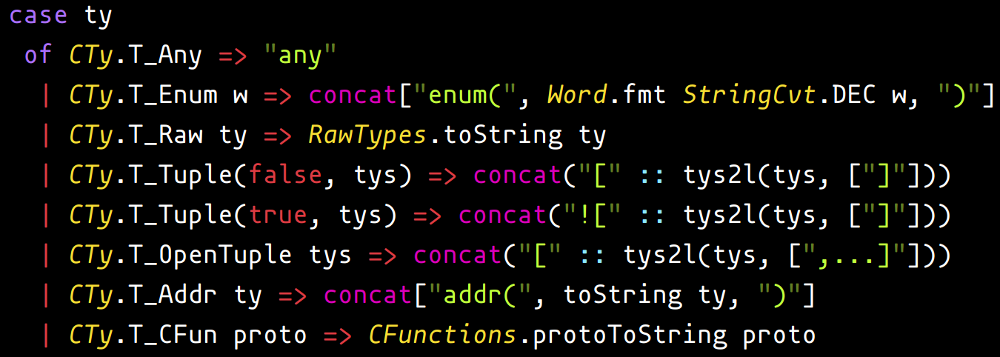

# "Better" Standard ML language support for Atom

This package provides the following for SML:

- Syntax highlighting.
- Code snippets.

This package was forked from [language-sml](https://github.com/Jakehp/language-sml)
to fast-track my own readability improvements for SML programmers using Atom.

### Syntax Highlighting Features

In addition to basic keyword highlighting, we also provide the following readability improvements:

- When a structure member is accessed, the structure's name is highlighted.
- Many entities available in the top-level namespace, such as `map` are highlighted.
- Some important punctuation such as `|`, `=>`, and `;` are also highlighted.
- Some operators, like `div` and `::` are highlighted.

Screenshot (using the "Fega High Contrast" theme to show all color classes):

### Contributing

Contributions are greatly appreciated. Feel free to open pull requests or make suggestions by opening an issue.
